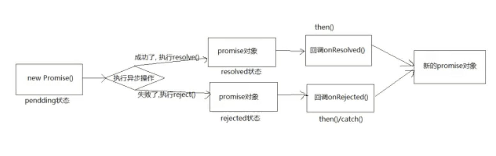

# promise

## 什么是 promise?

### 1.简述

ECMAscript 6 原生提供了 Promise 对象，Promise 对象代表了未来将要发生的事件，用来传递异步操作的消息。
promise 是一个自执行函数，我们只要调用它就开始执行了，只是 new 了一个对象，并没有调用它，我们传进去的函数就已经执行了，这是需要注意的一个细节。
promise 相当于异步操作结果的占位符，让函数返回一个 Promise 对象，解决异步回调地狱的问题。

### 2. promise 对象有如下三个特点：

1. pending 进行中 初始状态，不是成功或失败状态
2. fulfilled 意味着操作成功完成
3. rejected 失败完成 意味着操作失败
   promise 状态只能从 pending 状态进入到 fulfilled 和 rejected 其中的一个,即：  
   从 pending ➡️ fulfilled  
   从 pending ➡️ rejected  
   promise 状态一经改变不能再更改，因此 resolve，reject 只有第一次执行有效

then 和 catch 都会返回一个新的 promise，并且返回值不能是 promise 本身，否则会造成死循环，返回任意一个非 promise 的值都将包裹成 promise 对象，相当于 return Promise.resolve(data)
then 方法可传递两个参数，一个为 fulfilled 状态时调用的函数 resloved，一个为 rejected 时调用的函数 rejected

### 3.流程



## 为什么使用 promise？

之前处理异步是通过纯粹的回调函数的形式进行处理，很容易进入到回调地狱中，问题可以解决，但是难以读懂，维护困难，稍有不慎就会踏入回调地狱 - 嵌套层次深，不好维护
回调地狱就是回调函数嵌套调用，外部回调函数异步执行的结果作为内部回调函数执行的条件
promise 可解决回调地狱
在 promise 出现之前，比如在请求三个接口 api1,api2,api3 在请求 api3 接口的结果之前需要 api1,api2 依次请求之后，api1,api2 的返回结果作为 api3 请求接口的参数，这样很容易出现多层嵌套的问题，比如：

```javascript
$ajax({
  url: "http://www.api1",
  success: (res) => {
    $ajax({
      url: `http://www.api2`,
      success: (res) => {
        $ajax({
          url: `http://www.api3`,
          success: (res) => {
            console.log(res);
          },
        });
      },
    });
  },
});
```

```javascript
doFirstThing(function (result) {
  doSecondThing(
    result,
    function (result2) {
      doThirdThing(
        result2,
        function (lastResult) {
          console.log("get last result");
        },
        failureCallback
      );
    },
    failureCallback
  );
}, failureCallback);
```

以上代码是水平向右发展的，而且异常需要每个回调函数里面单独处理，这样不便于阅读而且很难维护
使用 promise 链式调用解决回调地狱问题，而且不用对每个回调进行异常处理，任何一个出了问题，最终都会穿透都会进入到 catch 方法里面（`异常穿透`），用 promise 异常处理方便，阅读方便，维护方便，同步编码方式。

终极解决方案：async await

```javascript
async function something1() {
  try {
    const result1 = await something2();
    const result2 = await something3(result1);
    const result3 = await something4(result2);
    console.log("get final result", result3);
  } catch (error) {
    console.log(error);
  }
}
```

## how 怎么使用 promise？

promise 方法会结合原理讲解：  
| 方法 | 描述 |  
| :---- | :---- |
| then() | 返回一个 promise，会等里面的 then()执行完，再执行外面的 |
| catch() | 返回一个 promise，捕获抛出的错误，处理拒绝的情况。它的行为与调用 Promise.prototype.then(undefined, onRejected) 相同 |
| all() | 返回一个 promise 实例，批量执行,全部执行完才算完成；如果参数中 promise 有一个失败（rejected），此实例回调失败（reject），失败原因是第一个失败 promise 的结果。在任何情况下，Promise.all 返回的 promise 的完成状态的结果都是一个数组，它包含所有的传入迭代参数对象的值（也包括非 promise 值）。 |
| race() | 返回一个 promise,类似于 Promise.all() ，区别在于它有任意一个完成就算完成，一旦迭代器中的某个 promise 解决或拒绝，返回的 promise 就会解决或拒绝。 |
| allSettled() | 返回一个 promise，该 promise 都已经 fulfilled 或 rejected 后的 promise，并带有一个对象数组，并且每个对象都描述每个 promise 的结果。 |
| finally() | 不管 promise 最后的状态是 resolve 还是 reject，在执行完 then 或 catch 指定的回调函数以后，都会执行 finally 方法指定的回调函数。 |
| any() | 接收一个 Promise 可迭代对象，只要其中的一个 promise 成功，就返回那个已经成功的 promise 。如果可迭代对象中没有一个 promise 成功（即所有的 promises 都失败/拒绝），就返回一个失败的 promise |
| 自定义 resolveDelay() | 返回一个 promise 对象，在指定时间后才产生结果 |
| 自定义 rejectDelay() | 返回一个 promise 对象，在指定时间后才失败 |

1. then()

```javascript
new Promise((resolve, reject) => {
  resolve(1);
})
  .then(
    (value) => {
      console.log("onResolved1", value);
    },
    (reason) => {
      console.log("onRejected1", reason);
    }
  )
  .then(
    (value) => {
      console.log("onResolved2", value);
    },
    (reason) => {
      console.log("onRejected2", reason);
    }
  );
```

那么，以上代码会有怎样的输出呢？

输出：
onResolved1 1
onResolved2 undefined

原因：new Promise 执行成功，而 promise.then()执行的回调函数由新的 promise 来决定，如果执行成功，将会执行 onResolved 的回调函数，反之如果新的 promise 对象执行失败，将会执行 onRejected 回调函数，所以第一个 then 中将会输出 onResolved1 1,第二个.then()执行什么回调函数由前一个.then 执行的结果决定，如果前一个.then 执行成功，则第二个.then 执行成功的回调函数（onResolved）,反之将会执行失败的回调函数（onRejected）;第一 then 由成功的输出，then 的返回结果是 undefined 所以第二个 then 中输出是 undefined

2. catch()

```javascript
var p1 = new Promise(function (resolve, reject) {
  resolve("Success");
});

p1.then(function (value) {
  console.log(value); // "Success!"
  throw "oh, no!";
})
  .catch(function (e) {
    console.log(e); // "oh, no!"
  })
  .then(
    function () {
      console.log("after a catch the chain is restored");
    },
    function () {
      console.log("Not fired due to the catch");
    }
  );
```

3. all()

```javascript
const p1 = Promise.resolve(2); //如果是一般值，p1 成功，value 就是这个值
const p2 = Promise.resolve(Promise.resolve(3)); //如果是成功的 promise，p2 成功，value 就是这个值
const p3 = Promise.resolve(Promise.reject(4)); //如果是失败的 promise，p3 失败，reason 就是这个值
p1.then((value) => console.log("p1", value));
p2.then((value) => console.log("p2", value));
p3.catch((reason) => console.log("p3", reason));
const p4 = new Promise((resolve, reject) => {
  setTimeout(() => {
    resolve(5);
    // reject(6);
  }, 1000);
})
  .then(
    (value) => {
      console.log("onResolved1", value);
    },
    (reason) => {
      console.log("onRejected1", reason);
      return new Promise((resolve, reject) => {
        reject(5);
      });
    }
  )
  .catch((err) => {
    console.log(err, "pppp");
  });

Promise.all([p1, p2, p4]).then(
  (value) => {
    console.log(value, "values");
  },
  (reason) => {
    console.log(reason, "reason");
  }
);
```

4. race()

```javascript
const promise = new Promise(function (resolve, reject) {
  console.log("promise");
  window.setTimeout(function () {
    if (false) {
      resolve("huangbiao");
    } else {
      // debugger
      reject("error");
    }
  }, 1000);
})
  .then(function () {
    console.log("success");
  })
  .catch(function () {
    console.log("catch");
  })
  .finally(function () {
    console.log("finally");
  });
```

5. allSettled()

```javascript
const promise1 = Promise.resolve(3);
const promise2 = new Promise((resolve, reject) =>
  setTimeout(reject, 100, "foo")
);
const promises = [promise1, promise2];

Promise.allSettled(promises).then((results) =>
  results.forEach((result) => console.log(result.status))
);
```

6. finally()

```javascript
const promise = new Promise(function (resolve, reject) {
  console.log("promise");
  window.setTimeout(function () {
    if (false) {
      resolve("huangbiao");
    } else {
      reject("error");
    }
  }, 1000);
})
  .then(function (value) {
    console.log("success", value);
  })
  .catch(function (reason) {
    console.log("catch", reason);
  })
  .finally(function () {
    console.log("finally");
  });
```

7. any()

```javascript
const pErr = new Promise((resolve, reject) => {
  reject("失败");
});

const pSlow = new Promise((resolve, reject) => {
  setTimeout(resolve, 500, "最终完成");
});

const pFast = new Promise((resolve, reject) => {
  setTimeout(resolve, 100, "很快完成");
});

Promise.any([pErr, pSlow, pFast]).then((value) => {
  console.log(value);
  // pFast fulfils first
});
```

8. resolveDelay()

```javascript
const p1 = Promise.resolveDelay(1, 2000);
s;
p1.then((value) => {
  console.log(value);
});
```

9. rejectDelay()

```javascript
const p2 = Promise.rejectDelay(2, 3000);
p2.then(null, (reason) => {
  console.log(reason);
});
```

promise.then()返回新的 promise 的结果状态由什么决定？

1. 简单表达：由 then()指定的回调函数的执行的结果决定
2. 详细表达：

- 如果抛出异常，新 promise 变为 rejected，reason 为抛出的异常
- 如果返回的是非 promise，新的 promise 变为 resolved，value 为返回的值
- 如果返回的是另一个 promise，此 promise 的结果就会成为新的 promise 结果

promise 支持链式调用

## where 在哪里使用 promise?

1. 主要用于异步计算
2. 可以将异步操作队列化，按照期望的顺序执行，返回符合预期的结果
3. 可以在对象之间传递和操作 promise，帮助我们处理队列

## how 怎么实现 promise？

原理请看 Promise_fun.js

## promise 优缺点

- 优点：

1. 支持链式调用;
2. 可以将异步操作以同步操作的流程表达出来，避免了层层嵌套的回调函数,解决回调地狱问题;
3. 此外，Promise 对象提供统一的接口，使得控制异步操作更加容易。

- 缺点：

1. 无法取消 Promise，一旦新建它就会立即执行，无法中途取消；
2. 如果不设置回调函数，Promise 内部抛出的错误，不会反应到外部；
3. 当处于 Pending 状态时，无法得知目前进展到哪一个阶段（刚刚开始还是即将完成）。

## 检验 promise

参考：https://www.jianshu.com/p/1b63a13c2701
https://segmentfault.com/a/1190000020034361
https://developer.mozilla.org/zh-CN/docs/Web/JavaScript/Reference/Global_Objects/Promise
